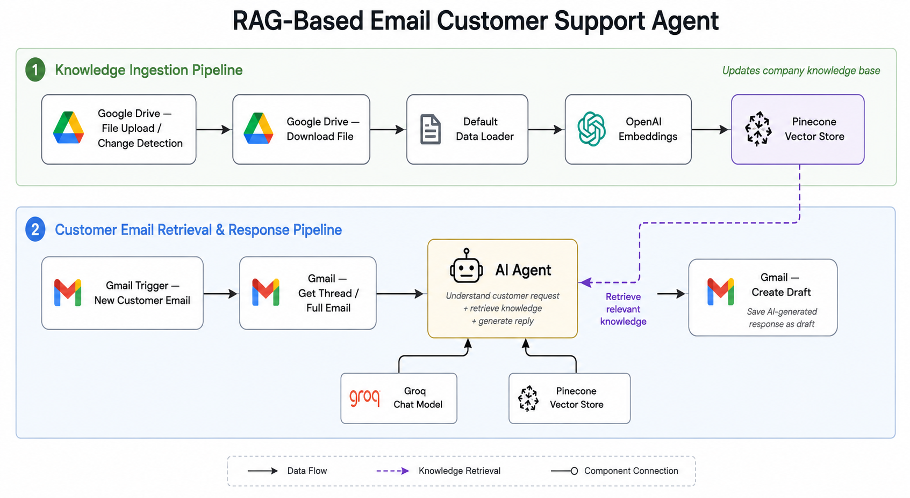

# RAG-Based Email Customer Support Agent




## Overview

The **RAG-Based Email Customer Support Agent** is an AI-powered customer
support automation workflow built with **n8n, Gmail, Pinecone, OpenAI
Embeddings, and a Groq Chat Model**.

The system reads incoming customer emails, retrieves relevant
information from the company's knowledge base using Retrieval-Augmented
Generation (RAG), generates a context-aware response, and saves the
response as a Gmail draft for human review.

This approach combines automation with human oversight, helping support
teams respond faster while reducing the risk of unsupported or
inaccurate answers.

------------------------------------------------------------------------

## What This Workflow Does

The workflow has two main pipelines:

### 1. Knowledge Ingestion Pipeline

Company documents stored in Google Drive are converted into searchable
vector representations and stored in Pinecone.

**Flow:**

`Google Drive → Download File → Data Loader → OpenAI Embeddings → Pinecone Vector Store`

When company documentation is updated, the ingestion workflow processes
the updated files and refreshes the knowledge available to the support
agent.

### 2. Customer Email Retrieval & Response Pipeline

When a new customer email arrives, the system retrieves the full email
content, sends it to the AI Agent, retrieves relevant company
information from Pinecone, and generates a professional response.

**Flow:**

`Gmail Trigger → Get Thread → AI Agent → Gmail Create Draft`

The AI Agent uses:

-   **Groq Chat Model** for response generation
-   **Pinecone Vector Store** as the knowledge retrieval tool
-   **Company documentation** as the source of factual information

------------------------------------------------------------------------

## How RAG Works in This System

The system uses **Retrieval-Augmented Generation (RAG)** to ground AI
responses in company-specific information.

### Step 1 --- Document Ingestion

Company documents are uploaded or updated in Google Drive.

### Step 2 --- Document Processing

The files are downloaded and processed using a data loader.

### Step 3 --- Embedding Generation

The document content is converted into numerical vector representations
using **OpenAI Embeddings**.

### Step 4 --- Vector Storage

The embeddings are stored in **Pinecone Vector Store**, allowing the
system to perform semantic searches.

### Step 5 --- Customer Question

A customer sends an email to the support account.

### Step 6 --- Information Retrieval

The AI Agent identifies what information is required to answer the
customer's questions and searches Pinecone for the most relevant
knowledge.

### Step 7 --- AI Response Generation

The retrieved information is provided to the AI Agent along with the
customer's email. The Groq Chat Model generates a clear and professional
response based on the available company information.

### Step 8 --- Human Review

The generated response is saved as a Gmail draft instead of being sent
automatically. A support representative can review, edit, and send the
response.

------------------------------------------------------------------------

## Key Components

  -----------------------------------------------------------------------
  Component                           Purpose
  ----------------------------------- -----------------------------------
  **Google Drive**                    Stores company knowledge-base
                                      documents

  **Data Loader**                     Processes uploaded documents

  **OpenAI Embeddings**               Converts documents into vector
                                      representations

  **Pinecone Vector Store**           Stores and retrieves relevant
                                      knowledge

  **Gmail Trigger**                   Detects incoming customer emails

  **Gmail Get Thread**                Retrieves the complete customer
                                      email

  **AI Agent**                        Understands customer requests and
                                      orchestrates retrieval

  **Groq Chat Model**                 Generates the final customer
                                      response

  **Gmail Create Draft**              Saves the generated response for
                                      human review
  -----------------------------------------------------------------------

------------------------------------------------------------------------

## AI-Powered Reply Generation

The AI Agent does not simply generate a response from its general
knowledge.

It follows this process:

``` text
Customer Email
      ↓
Understand Customer Request
      ↓
Search Pinecone Knowledge Base
      ↓
Retrieve Relevant Company Information
      ↓
Combine Customer Context + Retrieved Information
      ↓
Groq Chat Model
      ↓
AI-Generated Customer Reply
      ↓
Gmail Draft
```

This helps keep responses grounded in the company's own documentation.

------------------------------------------------------------------------

## Human-in-the-Loop

The system intentionally creates a **Gmail draft** instead of
automatically sending the AI-generated response.

This provides a human verification layer:

``` text
AI Generates Reply
       ↓
Gmail Draft
       ↓
Support Representative Reviews
       ↓
Edit if Necessary
       ↓
Send to Customer
```

This approach is useful for customer support because a human can verify
important information before the response reaches the customer.

------------------------------------------------------------------------

## Real-World Use Cases

### E-Commerce Customer Support

The system can answer questions about:

-   Orders
-   Shipping
-   Refunds
-   Returns
-   Product policies

### SaaS Customer Support

The system can handle questions about:

-   Pricing plans
-   Features
-   API limits
-   Account policies
-   Subscription information

### Logistics Support

The system can assist with:

-   Shipment-related information
-   Warehouse policies
-   Courier integrations
-   Service plans
-   API usage limits

------------------------------------------------------------------------

## Limitations & Challenges

### 1. Knowledge Base Accuracy

The quality of the response depends on the information stored in the
knowledge base. Outdated or incomplete documentation can lead to
incomplete answers.

### 2. Retrieval Quality

Poor document structure, chunking, or irrelevant search results can
cause the AI Agent to retrieve information that does not fully answer
the customer's question.

### 3. Complex Requests

Some requests require access to live systems, customer accounts, payment
information, or human judgment. The current RAG workflow cannot perform
these actions unless additional tools or APIs are connected.

------------------------------------------------------------------------

## Example

A customer asks:

> "How many users and warehouses are supported under the Professional
> plan? Does it include priority support? What are the API limits? Can
> we connect our own courier API?"

The system:

1.  Receives the email through Gmail.
2.  Retrieves the complete email thread.
3.  Identifies the customer's individual questions.
4.  Searches Pinecone for relevant company information.
5.  Provides the retrieved information to the AI Agent.
6.  Generates a structured response addressing the customer's questions.
7.  Creates a Gmail draft for a support representative to review.

------------------------------------------------------------------------

## Benefits

-   Reduces repetitive customer-support work
-   Speeds up response generation
-   Uses company-specific knowledge instead of relying only on general
    AI knowledge
-   Provides consistent responses
-   Supports multi-question customer emails
-   Keeps a human reviewer in the workflow
-   Allows the company knowledge base to be updated through Google Drive

------------------------------------------------------------------------

## Technology Stack

-   **n8n** --- Workflow automation and AI orchestration
-   **Gmail** --- Customer email trigger and draft generation
-   **Google Drive** --- Knowledge-base document storage
-   **Pinecone** --- Vector database and semantic retrieval
-   **OpenAI Embeddings** --- Document embeddings
-   **Groq** --- LLM for response generation

------------------------------------------------------------------------

## Workflow Summary

``` text
                 KNOWLEDGE INGESTION

Google Drive
     ↓
Download File
     ↓
Data Loader
     ↓
OpenAI Embeddings
     ↓
Pinecone Vector Store
           │
           │
           │ Relevant Knowledge
           ↓
     ┌───────────────┐
     │   AI Agent    │
     └───────┬───────┘
             ↑
             │
       Customer Email
             ↑
             │
       Gmail Trigger
             ↓
        Get Thread
             ↓
          AI Agent
             ↓
      Gmail Create Draft
             ↓
      Human Review
             ↓
       Send to Customer
```

------------------------------------------------------------------------

## Conclusion

The RAG-Based Email Customer Support Agent demonstrates how
**Retrieval-Augmented Generation can be combined with workflow
automation to create a practical AI customer-support system**.

Instead of relying solely on an LLM's general knowledge, the system
retrieves relevant information from a company-controlled knowledge base
and uses that information to generate responses. The final Gmail draft
is reviewed by a human before being sent, providing a balance between
automation, accuracy, and human oversight.
